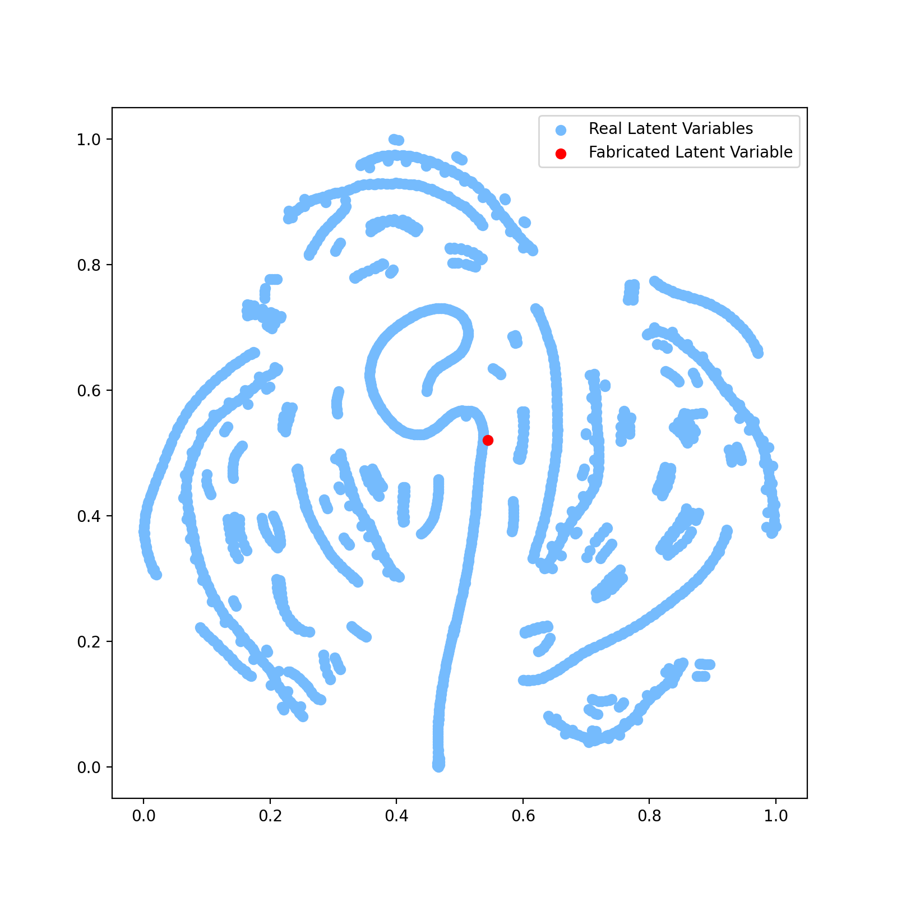
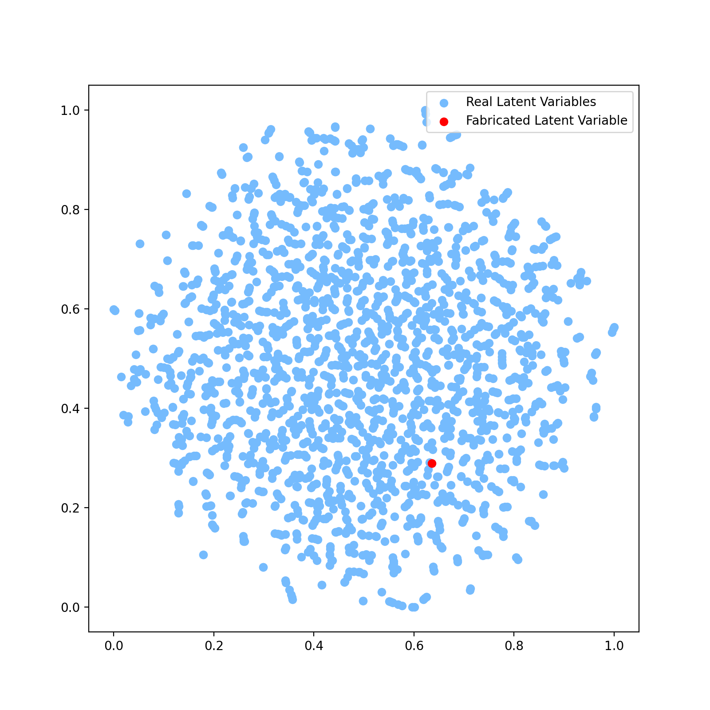

# SFC-CAE-Ready-to-use

## A self-adjusting Space-filling curve autoencoder
[](https://github.com/acse-jy220/SFC-CAE-Ready-to-use/blob/main/LICENSE)
[](https://github.com/acse-jy220/SFC-CAE-Ready-to-use/blob/main/.github/workflows/test.yml)

<br />
<p align="center">
  <a href="https://github.com/acse-jy220/SFC-CAE-Ready-to-use/blob/main/pics/structure_SFC_CAE.svg">
    
    <figcaption> Achitechture of a Space-filling curve Convolutional Autoencoder </figcaption>
  </a>
</p>

<p align="center">
  <a href="https://github.com/acse-jy220/SFC-CAE-Ready-to-use/blob/main/pics/structure_SFC_VCAE.svg">
    
    <figcaption> Achitechture of a Space-filling curve Variational Convolutional Autoencoder </figcaption>
  </a>
</p>


<details open="open">
  <summary>__Table of Contents__</summary>
  <ol>
    <li>
      <a href="#project-description">Project Description</a>
    </li>
    <li>
      <a href="#getting-started">Getting Started</a>
      <ul>
        <li><a href="#Dependencies">Prerequisites & Dependencies</a></li>
        <li><a href="#Installation">Installation</a></li>
      </ul>
    </li>
    <li><a href="#Template-Notebooks">Colab Notebooks</a>
      <ul>
        <li><a href="#advecting-block">Advection of a Block/Gaussian  (128 * 128 Structured Grid)</a></li>
        <li><a href="#FPC-DG">Flow Past Cylinder - DG Mesh (2000 snapshots, 20550 Nodes, 2/3 components)</a></li>
        <li><a href="#FPC-CG">Flow Past Cylinder - CG Mesh (2000 snapshots, 3571 Nodes, 2 components) </a></li>
        <li><a href="#CO2"> CO2 in the room - CG Mesh (455 snapshots, 148906 Nodes, 4 components)</a></li>
        <li><a href="#Slugflow"> Slugflow - DG mesh (1706 snapshots, 1342756 Nodes, 4 components)</a></li>
      </ul>   
    </li>
    <li><a href="#tSNE-Plots">t-SNE plots</a></li>
    <li><a href="#License">License</a></li>
    <li><a href="#Testing">Testing</a></li>
    <li><a href="#Contact">Contact</a></li>
    <li><a href="#Acknowledgements">Acknowledgements</a></li>
  </ol>
</details>

## Project Description

This project contains a self-adjusting Space-filling curve Convolutional Autoencoder (SFC-CAE), of which the methodlogy is based on the work of previous year https://arxiv.org/abs/2011.14820, this new tool automatically generates a SFC-CAE network for unadapted mesh examples, a simple variational autoencoder is also included.

## Getting started
### Dependencies

* Python ~= 3.8.5
* numpy >= 1.19.5
* scipy >= 1.4.1
* matplotlib ~= 3.2.2
* vtk >= 9.0
* livelossplot ~= 0.5.4
* meshio[all]
* cmocean ~= 2.0
* torch >= 1.8.0
* dash ~= 1.21.0
* pytest >= 3.6.4
* progressbar2 ~= 3.38.0
* (Optional) GPU/multi GPUs with CUDA

### Installation
1. Clone the repository:
```sh
$ git clone https://github.com/acse-jy220/SFC-CAE-Ready-to-use
```
2. cd to the repo:
```sh 
$ cd SFC-CAE-Ready-to-use
```
3. Install the module:

(1) For `pip` install, just use 
```sh
$ pip install -e .
```
It will compile the fortran library automatically, no matter you are on Windows or Linux.
<br>

(2) Create a `conda` environment via
```sh
$ conda env create -f environment.yml
```
but you need to compile the fortran code by yourself in this way. 
On linux, type
```sh
$ python3 -m numpy.f2py -c space_filling_decomp_new.f90 -m space_filling_decomp_new
```
<br>
On windows, install 

[MinGW](https://sourceforge.net/projects/mingw-w64/files/Toolchains%20targetting%20Win64/Personal%20Builds/mingw-builds/7.2.0/threads-posix/seh/)
(I use version 7.2.0) and compile fortran use

```sh
$ f2py -c space_filling_decomp_new.f90 -m space_filling_decomp_new --compiler=mingw32
```

4. For convenience, you could just simply import all functions in my module:
```python
from sfc_cae import *
```
and call the functions you want! Please have a look at the [instruction notebooks](#Template-Notebooks)

## Template Notebooks
### Advecting Block
[](http://colab.research.google.com/github/acse-jy220/SFC-CAE-Ready-to-use/blob/main/Colab_Notebooks/Instruction_SFC_CAE_Advecting.ipynb)

<p align="center">
  <p float="middle">
     <p float="middle">
     
     <p float="middle">
     <a href="pics/original_block.gif"><strong>Analytical Block Advection</strong></a>
     <p float="middle">
     
     <p float="middle">
     <a href="pics/reconstructed_block.gif"><strong>Reconstructed by 2-SFC-CAE-NN, 16 latent</strong></a>
  </p>
</p>

### FPC-DG
[](http://colab.research.google.com/github/acse-jy220/SFC-CAE-Ready-to-use/blob/main/Colab_Notebooks/Instruction_SFC_CAE_FPC_DG.ipynb)

<p align="center">
  <p float="middle">
     
     <a href="pics/original_FPC.gif"><strong>Original Velocity Magnitude</strong></a>
     
     <a href="pics/reconstructed_FPC.gif"><strong>Reconstructed by 2-SFC-CAE-NN, 8 latent</strong></a>
  </p>
</p>

### FPC-CG
[](http://colab.research.google.com/github/acse-jy220/SFC-CAE-Ready-to-use/blob/main/Colab_Notebooks/Instruction_SFC_CAE_FPC_CG.ipynb)

### CO2
[](http://colab.research.google.com/github/acse-jy220/SFC-CAE-Ready-to-use/blob/main/Colab_Notebooks/Instruction_SFC_CAE_CO2.ipynb)

<p align="center">
  <p float="left">
     
     <a href="pics/original_ppm.gif"><strong>Original CO2 PPM</strong></a>
     
     <a href="pics/reconstructed_3SFC_VCAE.gif"><strong>Reconstructed by 3-SFC-VCAE-NN, 16 latent</strong></a>
  </p>
</p>


### Slugflow
[](http://colab.research.google.com/github/acse-jy220/SFC-CAE-Ready-to-use/blob/main/Colab_Notebooks/Instruction_SFC_CAE_Slugflow.ipynb)

## tSNE plots
The creation of t-SNE plots in the Thesis are offered,

After you get FPC-CG data as well as sfcs by
```sh
$ bash get_FPC_data_CG.sh 
```

run  
```sh
$ python3 tSNE.py
```
at the root of this directory.
<p align="center">
  <p float="middle">
     
     <a href="pics/t-SNE-AE-CG-16-latent.png"><strong>t-SNE for SFC-CAE</strong></a>
     
     <a href="pics/t-SNE-VAE-CG-16-latent.png"><strong>t-SNE for SFC-VCAE</strong></a>
  </p>
</p>

## License

Distributed under the [Apache 2.0](https://github.com/acse-jy220/SFC-CAE-Ready-to-use/blob/main/LICENSE) License.

## Testing 
Some basic tests for the module are avaliable in [tests/tests.py](https://github.com/acse-jy220/SFC-CAE-Ready-to-use/blob/main/tests/tests.py) , you could execute them locally by 
```sh
$ python3 -m pytest tests/tests.py --doctest-modules -v
```
at the root of the repository, by running it, you will automatically download the **FPC_CG** data and two pretrained model (one SFC-CAE, one SFC-VCAE) for that problem and the MSELoss() / KL_div will be evaluated. A [github workflow](https://github.com/acse-jy220/SFC-CAE-Ready-to-use/blob/main/.github/workflows/test.yml) is also built to run those tests on github.

## Contact
* Jin Yu jin.yu20@imperial.ac.uk or yu19832059@gmail.com

## Acknowledgements
Great thanks to my supervisors:
* Dr. Claire Heaney
* Prof. Christopher Pain 